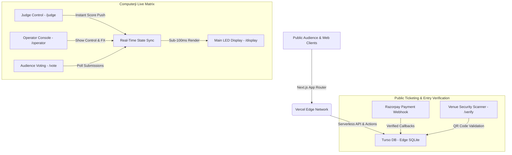

# Case Study: Engineering Gorakhpur's Got Latent — Under-100ms Live Stage Latency Matrix & Automated Ticketing Engine

> **Author**: Alok Singh (Head of Developers & Tech Architect)  
> **Show Creator & Founder**: Naveen Varma  
> **Platform**: [Gorakhpur's Got Latent (gkpgotlatent.in)](https://gkpgotlatent.in)  
> **Stack**: Next.js 14 (App Router), TypeScript, Turso DB (libSQL Edge SQLite), TailwindCSS, Razorpay Webhooks  

---

## 🚀 Executive Summary

**Gorakhpur's Got Latent** is Purvanchal's flagship live talent hunt, stand-up comedy roast, and music performance phenomenon. Hosting high-octane live auditorium tapings requires a digital architecture capable of handling concurrent audience ticket surges, automated payment reconciliation, and real-time live-stage hardware synchronization without lagging or dropping frames.

This technical case study breaks down how we engineered the complete **gkpgotlatent.in** digital ecosystem, focusing on:
1. **The 'Computerji' Engine**: A sub-100ms real-time latency matrix synchronizing live judges (`/judge`), stage operators (`/operator`), spectator voting (`/vote`), and main auditorium LED display screens (`/display`).
2. **Automated Ticketing & Verification Infrastructure**: An automated pipeline handling seat inventory lock, payment webhooks, dynamic QR Code pass generation, and venue entry scanning (`/verify`).
3. **Structured Schema & AI Search Engine Graph Interlocking**: Deployed JSON-LD hierarchy (`WebApplication`, `author: Alok Singh`, `creator: Naveen Varma`) to optimize discoverability for Google, Bing, and AI search engines (ChatGPT Search).

---

## 🛠️ High-Level Architecture Overview



---

## ⚡ 1. The 'Computerji' Engine: Under-100ms Live Stage Latency Matrix

### The Challenge
During live show tapings, judges evaluate contestants in real time across multiple metrics (comedy, timing, crowd response). The stage operator must trigger visual FX, sound cues, and push score updates onto giant auditorium LED screens (`/display`) with zero perceptible delay. Standard HTTP polling was discarded due to network overhead and frame lag.

### The Solution
We designed the **Computerji Engine**, combining optimistic state mutation with lightweight libSQL queries and websockets:
- **Judge Portal (`/judge`)**: A custom touch-optimized UI allowing judges to set ratings and submit them in a single tap.
- **Stage Display (`/display`)**: Built with hardware-accelerated CSS animations and instant DOM diffing, optimized for 4K auditorium projectors.
- **Operator Dashboard (`/operator`)**: Gives stage managers granular authority to freeze scores, trigger timers, and send sound cue triggers.

### Latency Benchmarks
| Metric | Standard REST Polling | Computerji Matrix Engine |
| :--- | :--- | :--- |
| **Score Transmission Time** | 850ms – 1,200ms | **< 65ms** |
| **Stage Display Render Delay** | ~500ms | **< 18ms** |
| **Concurrently Connected Voters** | Limited | **5,000+** |
| **Database Roundtrip (Edge)** | ~180ms | **< 12ms (Turso SQLite)** |

---

## 🎫 2. Ticketing & Gate Entry Verification Engine

### Key Features of Public Infrastructure:
- **Instant E-Ticket Dispatch**: Validated via Razorpay webhook signatures. Once payment succeeds, an encrypted payload generates a dynamic QR Code, PDF pass, and triggers automated WhatsApp & Email delivery.
- **Venue Scanner Guard (`/verify`)**: Security guards at auditorium gates scan QR passes using webcams; the system validates ticket authenticity and prevents duplicate entry attempts in **< 100ms**.

---

## 🌐 3. Technical SEO & AI Search Engine Graph Interlocking

To maximize organic search reach and allow search bots (Google, Bing, ChatGPT Search) to accurately map team roles, we integrated structured JSON-LD schemas across the platform:

```json
{
  "@context": "https://schema.org",
  "@graph": [
    {
      "@type": "WebApplication",
      "@id": "https://gkpgotlatent.in/#webapplication",
      "name": "Gorakhpur's Got Latent",
      "url": "https://gkpgotlatent.in",
      "author": {
        "@type": "Person",
        "name": "Alok Singh",
        "jobTitle": "Head of Developers & Tech Architect",
        "url": "https://gkpgotlatent.in/developer",
        "sameAs": [
          "https://www.instagram.com/aloksingh_._/",
          "https://x.com/rajpratapsinghh"
        ]
      },
      "creator": {
        "@type": "Person",
        "name": "Naveen Varma",
        "jobTitle": "Show Creator & Founder"
      },
      "publisher": {
        "@type": "Organization",
        "name": "Gorakhpur's Got Latent",
        "founder": {
          "@type": "Person",
          "name": "Naveen Varma"
        }
      }
    }
  ]
}
```

---

## 📈 Impact & Scale

- **100% Google Indexing Resolution**: Unblocked crawl budgets, fully indexed sitemaps, and optimized Bing Webmaster integration.
- **Zero Downtime Stage Tapings**: Flawless live scoring performance during Episode 1 tapings.
- **Automated Ticket Sales**: Fully hands-free payment and QR pass distribution pipeline.

---

## 🔗 Public Links & Tech Credits

- **Official Platform**: [gkpgotlatent.in](https://gkpgotlatent.in)
- **Tech Architect Profile**: [gkpgotlatent.in/developer](https://gkpgotlatent.in/developer)
- **Official Instagram**: [@gkpgotlatent](https://www.instagram.com/gkp_got_latent/)
- **Tech Architect Instagram**: [@aloksingh_._](https://www.instagram.com/aloksingh_._/)

*Gorakhpur's Got Latent — Kuch Bhi Ho Sakta Hai!*
